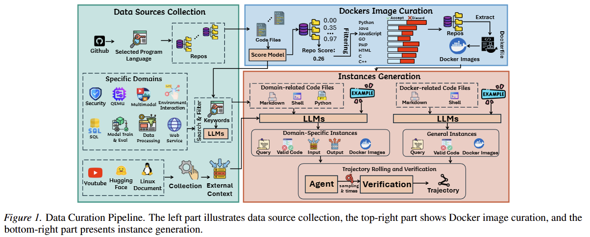
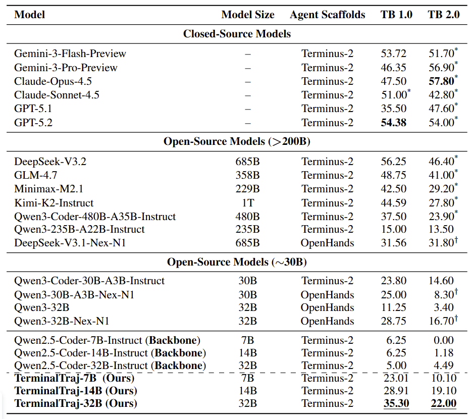
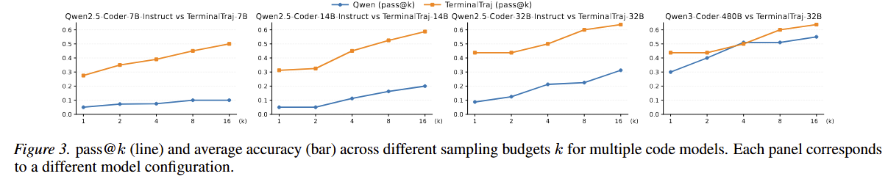

## Method

We propose **TerminalTraj**, a large-scale pipeline for generating Docker-aligned terminal agent trajectories from real-world GitHub repositories, with instance-specific executable validation.

To scale environments beyond heuristic repository filtering, we cast repository selection as model-based quality scoring, enabling automated construction of **32,325** Docker images across eight programming languages. We further curate instances spanning **eight** specialized domains with real-world tools and dependencies.

TerminalTraj filters rollouts via task-specific executable validators inspired by TerminalBench. Overall, TerminalTraj produces **50,733** verified trajectories and supports continual, scalable data synthesis.

  

## Results

  

  

As shown in the figures above, **TerminalTraj-32B** achieves state-of-the-art performance among models under 100B parameters on both **TB 1.0** and **TB 2.0**, with performance approaching that of **Qwen3-Coder-480B**.

In addition, we find that **TerminalTraj**, through its large-scale agentic training data grounded in real-world execution environments, substantially improves the model’s **test-time scaling** capability.
